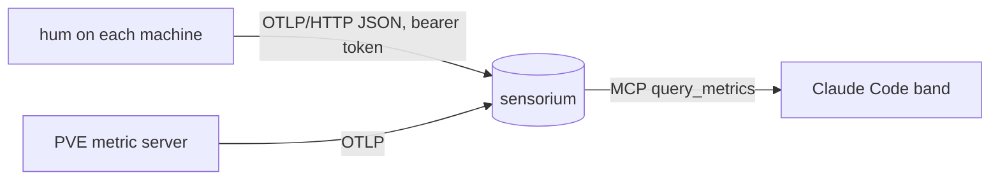

```
██╗  ██╗██╗   ██╗███╗   ███╗
██║  ██║██║   ██║████╗ ████║
███████║██║   ██║██╔████╔██║
██╔══██║██║   ██║██║╚██╔╝██║
██║  ██║╚██████╔╝██║ ╚═╝ ██║
╚═╝  ╚═╝ ╚═════╝ ╚═╝     ╚═╝
```

# hum

> Every machine's hum, in one line: a 7 MB agent that speaks OTLP, and a Claude Code band that reads it back.

`opentelemetry` · `otlp` · `host-metrics` · `claude-code`

[](https://github.com/zyx1121/hum/actions) &nbsp;[](#license)

You own a few machines: a Proxmox host, a GPU box, a laptop, a Mac mini. Checking on them meant an ssh round per machine, or a full Prometheus stack you never got around to. hum is one small binary per machine that reports CPU, memory, disks, network and uptime to any OpenTelemetry endpoint, plus a Claude Code band that shows all of them above the prompt.

```
 💻 cpu mem disk  ● pve 1% 73% 67%  ● carrel01 no data  ● king 4% 36% 87%  ● laptop 4% 64% 13%  ● macmini 2% 76% 98%
```

## What it does

- **Reports host metrics**: CPU, memory, every fixed disk, network bytes and uptime, every 15 seconds, as OTLP/HTTP JSON.
- **Stays small**: one static binary (about 7 MB, about 17 MB resident) for Linux, Windows and macOS, no SDK, no config file.
- **Runs where binaries cannot**: on Windows with Smart App Control on, the installer falls back to `hum.ps1`, which sends the same metrics.
- **Shows them in Claude Code**: the `hum` plugin draws one line above the prompt, with offline machines in red.

## Deploy

hum is an agent, not a server, so it ships as binaries instead of an image. Download the one for your machine from [Releases](https://github.com/zyx1121/hum/releases), then:

| OS | Runs as | How |
|----|---------|-----|
| Linux | systemd service | copy [deploy/hum.service](deploy/hum.service) to `/etc/systemd/system/`, put the token in `/etc/hum/token`, `systemctl enable --now hum` |
| macOS | launchd agent | copy [deploy/tw.zyx.hum.plist](deploy/tw.zyx.hum.plist) to `~/Library/LaunchAgents/`, fill in the placeholders, `launchctl bootstrap gui/$(id -u) <plist>` |
| Windows | service, or a startup task under Smart App Control | put `hum.exe`, `hum.ps1` and a `token` file next to [deploy/install-windows.ps1](deploy/install-windows.ps1) and run it as Administrator |

> [!IMPORTANT]
> The token file is the only secret. Keep it readable by the agent alone: the Windows installer limits it to SYSTEM and Administrators, the systemd unit passes it as a credential to a dynamic user.

Proxmox VE 9.1 and later can skip the agent: its built-in OpenTelemetry metric server (`pvesh create /cluster/metrics/server/<id> --type opentelemetry`) reports the node and every guest.

## Use

1. Create an ingest token on your OTLP backend. With [sensorium](https://github.com/zyx1121/sensorium): `docker compose run --rm ingest register-project devices`.
2. Install the agent on each machine with that token and `-endpoint https://<backend>/v1/metrics`.
3. Check one snapshot without sending anything: `hum -once`.

For the Claude Code band:

```sh
/plugin marketplace add zyx1121/hum
/plugin install hum@hum
```

The band reads sensorium's MCP endpoint with the token in `SENSORIUM_ZYX_TOKEN`, and needs function hooks on (`CLAUDE_CODE_ENABLE_FUNCTION_HOOKS=1`). The machine list is at the top of [plugin/hooks/register.tsx](plugin/hooks/register.tsx).

## Configure

| Flag | Env | What it sets | Default |
|------|-----|--------------|---------|
| `-endpoint` | `HUM_ENDPOINT` | OTLP/HTTP metrics URL | required |
| `-token-file` | `HUM_TOKEN_FILE` | file holding the bearer token | none |
| `-host` | `HUM_HOST` | `host.name` to report | OS hostname, lowercased |
| `-interval` | | time between reports | `15s` |
| `-once` | | print one payload to stdout and exit | off |

## How it works



Each tick hum reads the host through [gopsutil](https://github.com/shirou/gopsutil) and posts one export request with OpenTelemetry semantic-convention names (`system.cpu.utilization`, `system.memory.utilization`, `system.filesystem.utilization`, `system.network.io`, `system.uptime`). Every point also carries `host.name`, so backends that drop the resource still tell machines apart. A failed post is logged once and dropped; the next tick tries again. The agent holds only an ingest token, which can write metrics and read nothing.

## Develop

```sh
go test ./...
go run . -once
GOOS=windows GOARCH=amd64 go build -o dist/hum.exe .
```

The plugin lives in [plugin/](plugin/): `claude plugin test plugin` runs its tests. CI runs `go vet`, the tests, and cross-builds every target; a `v*` tag publishes the binaries to a release.

## Limitations

- No buffering: metrics from while the endpoint is down are lost.
- No GPU, temperature or battery metrics yet.
- The macOS agent runs while its user is logged in (a LaunchAgent); a LaunchDaemon needs root.
- The band's machine list is in code, not settings.

## License

MIT
